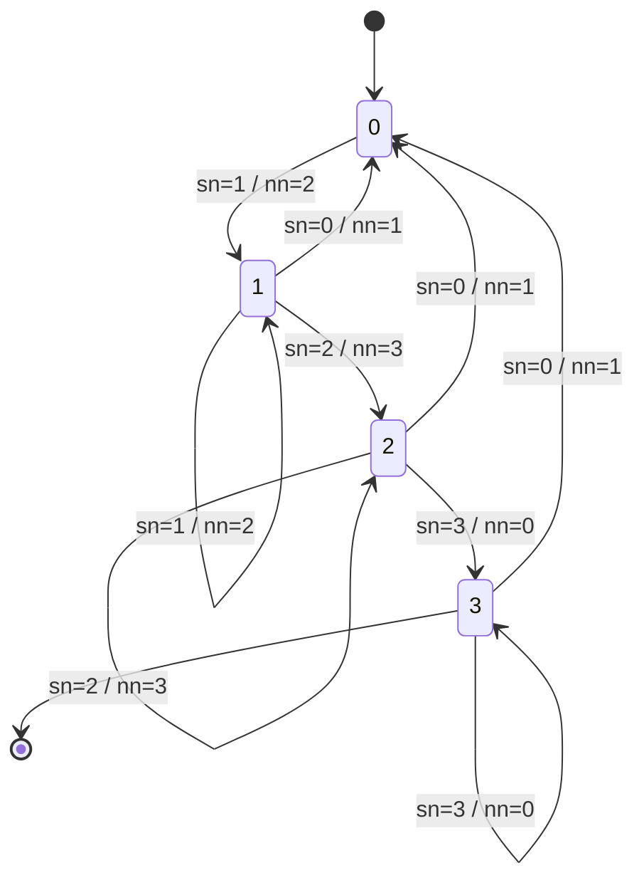

## README for package `udpsocket-jwt-server.py`: This Readme explains the basic usage of the Python script for a UDP sockets service that receives data from a group of students. The data needs to be encoded in JWT and signed by RSA algorithm (RS256) and the responses will be in JWT signed using HMAC (HS256).


## Description and goals

Program (Python Script) that creates a UDP socket server and implements a simple protocol for receiving simple information in the form of JWT.

Main goal: laboratory used by limited group of students (UFSC-DEC7557) to send information about their members.

What are in the lab:
- socket programming (UDP)
- creating and signing JWT tokens (JWS)
- verifing JWS tokens
- how include some reliability mechanisms over UDP
- reliability mechanisms: error detection (digital signature check), positive acknowledgments (ACKs), retransmissions, message ordering

Considerations:
- the group names and their public keys need to be defined previously
- the request contains sequential number and the maximum number of elements
- the protocol of message ordening is based on simple finite state machine
- the states of protocol are limited by the number of group members

## ** Functionality**: how the protocol works 

The protocol is about the states that the program goes through in response to requests (events) and the respective actions taken.

The PAYLOAD of REQUEST contains:
```JSON
{
"group": "HEARTBEAT",
"seq_number": 1,
"seq_max": 4,
"matricula": 123456789,
}
```

* `"group": "HEARTBEAT"` This contains the name of the group. This name is used for testing purposes.

* `"seq_number": 1`  This contains the number of the member of the group about the data in payload.

* `"seq_max": 4`  What is the number of the group members.

* `"matricula": 123456789` This is the number of the student (group member).

If the signature of JWS that contains the payload of request is OK, then there is generated a response in JWS. The Payload of RESPONSE contains:

* a hash of the request payload (SHA256)

* the information of the next number expected by server: indicates a ACK to the information provided in request. How is calculated:
- case 1: next_number = seq_number + 1
- case 2: next_number = 0  in the case all the data are received

```JSON
{
  "id_request": "f12010c0ec208fae7b0031714839f7d639d921c6a6e73ad97a1aab4cc21ba43e",
  "next_number": 2,
  "otp_number": 3205,
  "otp_timestamp": 1687046022,
}
```

- `"id_request": "f12010c0ec208fae7b0031714839f7d639d921c6a6e73ad97a1aab4cc21ba43e"` This contains the hash (SHA256) of the request payload.

- `"next_number": 2"`  What is next number expected by the protocol (this is an **implicit ACK**)

- `"otp_number": 3205`  This contains a OTP random number generated during create of Response

- `"otp_timestamp": 1687046022`  This is a OTP timestamp generated during create of Response

### Finite state diagram of the protocol for the messages

For this FSM there will by used abreviations:
- `sn` for seq_number (EVENT)
- `nn` for next_number (ACTION) and true to a generation of answer (ACTION) (this is implicit)
- F false for NO ACTION: this is triggered when user sends a sequence number out of the ordering (next_number)


Example: the two examples and the FSM assumes that the number of ***group members is three***.

a) `sn=1` / `nn=2`  means EVENT:`sn=1` / ACTION:`nn=2`

If the server received a payload with `seq_number=1` in state 0, then the server generates a response (True) with the `next_number=2`.

b) `sn=0` / `nn=1`  means EVENT: `sn=0` / ACTIONS:`nn=1`

If the server received a payload with `seq_number=0` in any state, then the system returns to the initial state and responds with the next number expected: `next_number=1`.


Protocol definition about the `next_number`: the number generation will take account the value of 
`max number` from two sources:

a) from request; or

b) from data definition in groups_num_members. In his version (20230629), the option (b) will be used.

### About cryptographic protocols and keys

The script supports two algorithm for signatures: RS256 and HS256.

RS256: public cryptography: RSA algorithm. There are suport for keys (public RSA keys) in these formats:

a) PEM format generated by OpenSSL or by [Cyberchef](https://cyberchef.org) **group_name.pem**

b) SSH format generated by ssh-keygen **group_name.ssh**

Obs.: the public keys are saved in the directory keys_priv and the naming convection is:
- `group_name.pem`: for keys in PEM format
- `group_name.ssh`: for keys in SSH format
Where the `group_name` where used in the program for linking the key with the group.


## Considerations about security

The program uses sockets UDP, so there are no guarantees or reliability and security.

* The system provides INTEGRITY through the use of cryptographic signatures in requests and responses.

* There is NO CONFIDENTIALITY in the content and type of messages.

* The authenticity is provided:

a) in request by RSA signatures using RS256 [RFC7518 - Digital Signature with RSASSA-PKCS1-v1_5](https://datatracker.ietf.org/doc/html/rfc7518#section-3.3), and,

b) in response by HMAC [RFC7518 -  HMAC with SHA-2 Functions](https://datatracker.ietf.org/doc/html/rfc7518#section-3.2)


# Executing the script program

The main script:
* `udpsocket-server-jwt.py`

Directories:
* `keys_priv`   Directory for private keys (only for the secret)
* `keys_priv/key_secret_for_hmac.txt`  This is the file for passphrase for HMAC
* `keys_pub`    Directory for public keys: signatures check. Each key for a group is specified as: group_name.pem or group_name.ssh

There are three parameters: all optional:

```python
$ python3 udpsocket-server-jwt.py 127.0.0.1 5555 $HOME/tmp/
```
Parameters:

- `127.0.0.1` local endpoint: IPv4 address
- `5555` local endpoint: port (5555/UDP)
- `$HOME/tmp/`  Directory for keys and for logs (optional). If not set, the current directory will be used.

##  CHANGELOG

202305   : v.0.1: Initial version.

20230615 : v.1.0: the script is functional and running in a cloud instance

20230623 : v.1.5: corrections and improving; the protocol function was amended.

20230626 : v.1.7: publication in Github; documenting and commenting the code.

20230629 : v.1.8: changed the protocol to account the max_number from the code.


# TODO

a) Add more exception handling features.

b) Rewrite some names for readability.

c) Improve the messaging protocol: ordering and acknowledgments.

d) Review the protocol to account for the possibility of saving and tracking information already received and recognized.

e) Include parameters for logs and for keys (now is the same).

f) Improve program/system execution resiliency.


### Meta

Autor: G Camillo
Last revision: 20230701

- This is for testing and lab for networking.
- About the Python code: this one is written by a person in the early stages of learning the language, so don't expect to use the best solution.

https://help.github.com/articles/creating-and-highlighting-code-blocks/

https://docs.github.com/en/get-started/writing-on-github/working-with-advanced-formatting/creating-diagrams

https://mermaid.js.org/intro/


