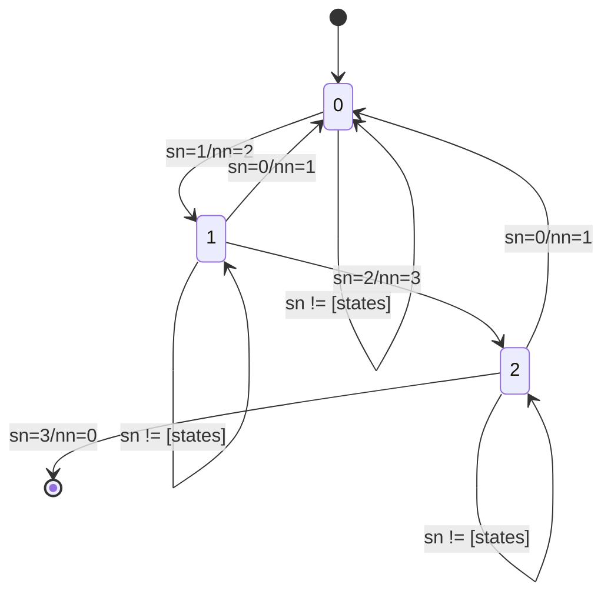

## README for package `udpsocket-jwt-server.py`: This Readme explains the basic usage of the Python script for a UDP sockets service that receives data from a group of students. The data need to be encoded in JWS token and signed by public key algorithm (RS256 or ES256). The responses will be in JWS signed using HMAC (HS256).

## Description and goals

Program (Python Script) that creates a UDP socket server and implements a simple protocol for receiving information about users (claims) provided in JWT format.
Main goal: this lab if for Networking class at [UFSC Araranguá](https://enc.ufsc.br/).

The contents of this lab are:
- socket programming (UDP)
- creating and signing JWT tokens (JWS)
- verifing JWS tokens (error detection for the payload)
- reliability (weak) using UDP
- reliability mechanisms: error detection (digital signature check), positive acknowledgments (ACKs), retransmissions, message ordering

Considerations:
- the server uses public keys provided offline by the group
- only two types of public keys are used (JWS alg signatures): RS256 (RSA) and ES256 (EcDSA)
- the request contains sequential number for message ordering
- the server protocol of message ordering is based on simple finite state machine
- the states of protocol are limited by: the number of group members or static defined (this version: fixed number of 7)

** Important notice: _this readme is in revision_. 20231111 **

## Functionality: how the protocol works

The protocol is about the states that the program goes through in response to requests (events) and the respective actions taken. The user uses UDP socket to send a JWT with signature (JWS - [JSON Web
              Signature](https://datatracker.ietf.org/doc/html/rfc7515)) 

The PAYLOAD of REQUEST contains:
```JSON
{
  "sub": "HEARTBEAT",
  "seq_state_number": 1,
  "seq_state": "ORANGE",
  "seq_max": 1,
  "registration": 222222,
  "jti": "eaaed2ff0c3ca8e46ed319cb2d45b25e",
  "iat": 1699737057,
  "exp": 1699737237,
  "aud": "udp.socket.server.for.jwt"
}
```
The payload contains claims (information about something) and some are [Registered Claim Names](https://datatracker.ietf.org/doc/html/rfc7519#section-4.1)
while others are [Private Claim Names](https://datatracker.ietf.org/doc/html/rfc7519#section-4.3):

* `sub: HEARTBEAT` (Subject) The name of the group. The name HEARTBEAT is used for testing purposes.

* `seq_state_number: 1`  The sequence number of this message (message ordering). The server uses this to walk through a finite machine state (the number of states were discussed below).

* `seq_state: ORANGE` The state in a form of rainbow colors (seven states). Each number in `seq_state_number` is associated with colors: RED:0, ORANGE:1, YELLOW:2, GREEN:3, BLUE:4, INDIGO:5, and VIOLET:6.

* `seq_max: 4`  What is the number of the group members (not used in this version).

* `registration: 222222` This is the number of registration of the student (group member).

* `jti: eaaed2ff0c3ca8e46ed319cb2d45b25e` (JWT ID) Unique identifier of this token and for this message. Contains 128 bits of random data (hexadecimal format).

* `iat: 1699737057` (Issued At) Timestamp (Unix Epoch) of the date-time of the generation of token.

* `exp: ` (Expiration Time) Timestamp (Unix Epoch).

* `aud: udp.socket.server.for.jwt` (Audience) Name of this service.


The server checks some claims (`iat`,`exp`,`sub`) and the signature of JWS. If there were no problem, then the server uses the information in claim `seq_state_number` to assert the state of the protocol (sequence of messages). The description will be explained below.
that contains the payload of request is OK, then there is generated a response in JWS. The Payload of RESPONSE contains:


```JSON
{
  "iss": "udp.socket.server.for.jwt",
  "sub": "HEARTBEAT",
  "jti": "4c52e4570136fd3b71997cc58a64a502",
  "iat": 1699740318,
  "exp": 1699740348,
  "id_request": "0aff628571c0f919a54faab575d4b3894166b1ac558df1caf14c44b50ffca3a9",
  "otp_timestamp": "2023-11-11T22:05:18.871759+00:00",
  "next_number": 3
}
```
Some claims have the same meaning those of request. The other claims have the following meaning:
* `id_request: f12010c0ec208fae7b0031714839f7d639d921c6a6e73ad97a1aab4cc21ba43e` Hash (SHA256) of the request payload in hexadecimal format.

* `otp_timestamp: 2023-11-11T22:05:18.871759+00:00`  Timestamp of creation of the response (token JWS). It is the same as a `iat` but in a ISO 8601 format.

* `next_number: 2`  The next number expected by the server (this is an **implicit ACK**). How this next number is calculated:
- case 1: next_number = seq_number + 1   # for ordering purposes
- case 2: next_number = 0  # if the server protocol reached the final state (all data received)


### Finite state diagram of the protocol for the messages

Abbreviations used in this description:
- `sn` for `seq_state_number` (EVENT from request)
- `nn` for `next_number` (ACTION for response); the generation of the response indicates an implicit ACK.
- F false for NO ACTION: this is triggered when user sends a sequence number (`seq_state_number`) out of the number of states in the FSM protocol.

Example: consider that there are ***three states*** in this FSM.

a) `sn=1` / `nn=2`  means EVENT:`sn=1` / ACTION:`nn=2`

If the server received a payload with `seq_state_number=1` in state 0, then the server generates a response with the `next_number=2` (the next state expected).

b) `sn=0` / `nn=1`  means EVENT: `sn=0` / ACTIONS:`nn=1`

If the server received a payload with `seq_number=0` in any state, then the system returns to the initial state and responds with the next number expected: `next_number=1`.


The maximum of number of states can be defined from two sources:

a) from request (claim `seq_max`; or

b) from data definition in the code: `NUM_STATES`. This version (rainbow) will have seven states.

### About cryptographic protocols and keys

The script supports two algorithms for JWS signatures: RS256 and HS256. Reference: [JSON Web Algorithms (JWA)](https://datatracker.ietf.org/doc/html/rfc7518).
* RS256 (RSASSA-PKCS1-v1_5 using SHA-256)
* ES256 (ECDSA using P-256 and SHA-256)

 
Public keys format supported in the script:
* PEM format generated by OpenSSL or by [Cyberchef](https://cyberchef.org) **groupname.pem**
* SSH format generated by ssh-keygen **groupname.ssh**

Obs.: the public keys are saved in the directory keys_priv and the naming convection is:
* `groupname.pem`: for keys in PEM format
* `groupname.ssh`: for keys in SSH format
Where the `group_name` where used in the program for linking the key with the group.


## Considerations about security

The program uses sockets UDP, so there are no guarantees or reliability and security.

* The system provides INTEGRITY through the use of cryptographic signatures in requests and responses.

* There is NO CONFIDENTIALITY about the payload and type of messages.

* The authenticity is provided:

In **request** by RSA signatures using RS256 [RFC7518 - Digital Signature with RSASSA-PKCS1-v1_5](https://datatracker.ietf.org/doc/html/rfc7518#section-3.3):
```JSON
{
  "typ": "JWT",
  "alg": "RS256"
}
```
Or, by ECDSA signatures using ES256 [ECDSA using P-256 and SHA-256 ](https://datatracker.ietf.org/doc/html/rfc7518#section-3.4):
```JSON
{
  "typ": "JWT",
  "alg": "ES256"
}
```
In **response** by HMAC [RFC7518 -  HMAC with SHA-2 Functions](https://datatracker.ietf.org/doc/html/rfc7518#section-3.2):
```JSON
{
  "typ": "JWT",
  "alg": "HS256"
}
```


# Executing the script program

The main script:
* `udpsocket-server-jwt.py`

Directories:
* `keys_priv`   Directory for private keys (only for the secret)
* `keys_priv/key_secret_for_hmac.txt`  This is the file for passphrase for HMAC
* `keys_pub`    Directory for public keys: signatures check. Each key for a group is specified as: group_name.pem or group_name.ssh

There are three parameters: all optional:

```bash
$ python3 udpsocket-server-jwt.py 127.0.0.1 44555 $HOME/tmp/
```
Parameters:

- `127.0.0.1` local endpoint: IPv4 address
- `44555` local endpoint: port (44555/UDP)
- `$HOME/tmp/`  Directory for keys and for logs (optional). If not set, the current directory will be used.

##  CHANGELOG

202305   : v.0.1: Initial version.

20230615 : v.1.0: the script is functional and running in a cloud instance

20230623 : v.1.5: corrections and improving; the protocol function was amended.

20230626 : v.1.7: publication in Github; documenting and commenting the code.

20230629 : v.1.8: changed the protocol to account the max_number from the code.

20231111 : v.2.0: the code was revised; definitions were updated; fixed number of states in proto


# TODO

a) Add more exception handling features.

b) Improve the messaging protocol: ordering and acknowledgments.

c) Review the protocol to account for the possibility of saving and tracking information already received and recognized.

d) Include parameters for logs and for keys (now is the same).

e) Increased resilient execution.


### Meta

Autor: G Camillo
Last revision: 20231111 (rainbow version),  20230701

- This is for testing and lab for networking.
- About the Python code: this one is written by a person in the early stages of learning the language, so don't expect the best solutions.

https://help.github.com/articles/creating-and-highlighting-code-blocks/

https://docs.github.com/en/get-started/writing-on-github/working-with-advanced-formatting/creating-diagrams

https://mermaid.js.org/intro/


